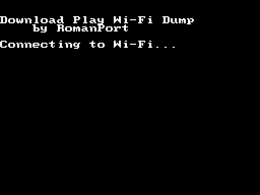

# nds-wifidump
NDS Wi-Fi Dump is a simple Nintendo DS (NOT DSi) homebrew app that allows you to dump GBA ROMs and save files via Wi-Fi, without the need for a flashcart. I developed it specifically so I could dump my Pokemon GBA saves without having to buy a flash cart.

At the moment, it supports dumping GBA ROMs and save files, and in the future I plan to add a way to upload GBA save files back to the cartridge, although this isn't implemented yet.

Downloads are seamlessly compressed with zlib, which saves a LOT of time. The Nintendo DS can compress at a decent speed, but it's Wi-Fi connection is SLOOOOOOW. This cut ROM downloads from 45 minutes to 10 minutes or less.

While all ROMs I dumped were verified to be dumped successfully, I'd still recommend Googling the SHA-256 hash of dumped ROMs to make sure they were dumped correctly.

## Usage
Once you've launched the app (see the getting it running section below) usage is pretty simple. The app will first connect to Wi-Fi, then display it's IP address. If it never progresses beyond "Connecting to Wi-Fi...", check your network settings.

Once the IP address appears, open up a web browser on your computer and navigate to it. You'll get a table of available sources. Simply click the download link to begin a download!

Only one request is handled at a time. Additionally, make sure you're using a modern browser that'll support the zlib HTTP compression. It helps a lot.

## Getting it Running (without a flash cart, with a Wii or Wii U)
This is the intended method to use this app, and is how I developed it. To use this method, you'll need a homebrewed Wii or vWii (on a Wii U) and an SD card for it. We'll be using DS Download Play, initiated by the Wii, to get this app running on the DS.

* Before you begin, make sure Wi-Fi is configured correctly on your Nintendo DS. You'll need to configure this by inserting a Wi-Fi enabled game and configuring the system settings through it.
* Now, insert your SD card into your computer.
* You'll need the Wii homebrew app [wii-ds-rom-sender](https://github.com/FIX94/wii-ds-rom-sender) to send this homebrew app to your DS using Download Play. Download it, and extract the folder to the ``apps/`` folder on the SD card.
* Additionally, to allow unsigned code to run on the DS over Download Play, we'll need to use an exploit called haxxstation. You'll need to (questionably legally) obtain the DS Download Station ROM and place it on the root of the SD card with the name ``haxxstation.nds``. You'll need to do some Googling for this.
* Finally, create an ``srl`` folder on the root of the SD card and download a release (or build it yourself!) of this app and place the .nds file in the folder. You can now remove the SD card and put it in your Wii (U).
* Start up the Wii / vWii (for Wii U) Homebrew Launcher and start the wii-ds-rom-sender program. Choose the defaults, and pick the .nds file for nds-wifidump.
* Now, start up your Nintendo DS and open up Download Play. You should see a detected download available. Start it downloading.
* Once it's finished downloading, you'll be in the DS Download Station. After a few moments, nds-wifidump should appear here. Download it.
* You're all set!
